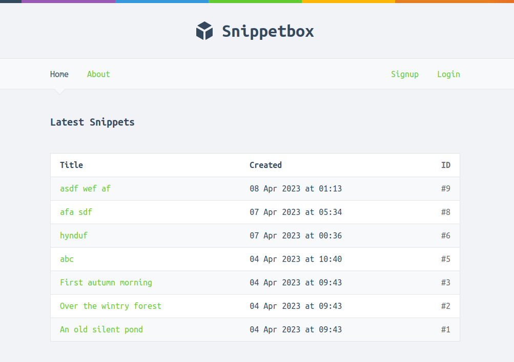

# A Snippet Website written in Go

- A simple website written in Go following the [Let's Go](https://lets-go.alexedwards.net/) guide book that allows users to save code snippets for a certain amount of time before they expire. The website is similar to Pastebin and allows users to easily share code with others.

